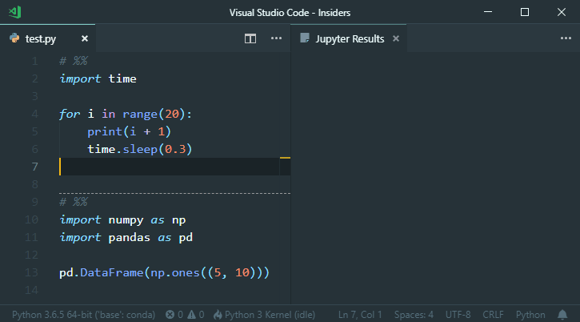

# Jupyter

[](https://ci.appveyor.com/project/yzhang-gh/vscode-jupyter/build/artifacts)

## Features

In addition to the [Jupyter extension by DonJayamanne](https://marketplace.visualstudio.com/items?itemName=donjayamanne.jupyter), we have

- Auto scrolling to bottom when showing results ([DonJayamanne/vscodeJupyter#97](https://github.com/DonJayamanne/vscodeJupyter/pull/97))

- Default keybinding

  - <kbd>Ctrl</kbd> + <kbd>Enter</kbd> for `execCurrentCell`

  - **Tip**: Use <kbd>Ctrl</kbd> + <kbd>Alt</kbd> + <kbd>Enter</kbd> to execute selected code (or current line if no selection)

- Many UI improvements

- New option `jupyter.codelens.enabled` (default `false`)

## Demo



---

Recommend [Highlight](https://marketplace.visualstudio.com/items?itemName=fabiospampinato.vscode-highlight) extension with setting

```json
"highlight.regexes": {
    "(^# ?%%.*)": {
        "decorations": [
            {
                "after": {
                    "border": "1px dashed #999",
                    "contentText": "",
                    "height": "2px",
                    "margin": "0 0 4px 10px",
                    "width": "50%"
                }
            }
        ]
    }
}
```

## Preview Version

Download the preview version (`.vsix` file) [here](https://ci.appveyor.com/project/yzhang-gh/vscode-jupyter/build/artifacts)

## Others

Forked from [DonJayamanne/vscodeJupyter](https://github.com/DonJayamanne/vscodeJupyter)

Extension logo from [jupyter/design](https://github.com/jupyter/design).
